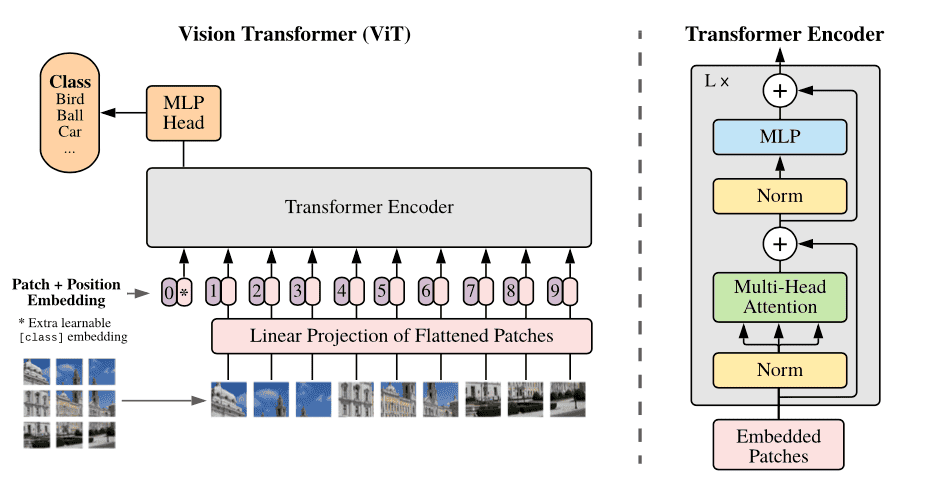

# Vision Transformer (ViT) from Scratch with PyTorch



## Introduction

This project is a hands-on guide to understanding and training **Vision Transformers (ViT)** from scratch using the **PyTorch** framework.

Through a step-by-step Jupyter notebook and modular Python scripts, we implement the key components of a Vision Transformer, including patch embedding, multi-head self-attention, layer normalization, and classification heads.

The goal of this repository is to provide an educational yet functional implementation of ViT that you can train on standard image datasets such as CIFAR-10 or MNIST.

## What you will learn

- The internal architecture of the Vision Transformer (ViT).
- How to split an image into patches and embed them as tokens.
- How multi-head self-attention works in vision tasks.
- How to train and evaluate a ViT model from scratch.
- Using cosine learning rate schedulers and AdamW optimization.
- Visualizing and tracking training progress with TensorBoard.

## Technologies

- [PyTorch](https://pytorch.org/)
- [Torchvision](https://pytorch.org/vision/stable/index.html)
- [NumPy](https://numpy.org/)
- [TensorBoard](https://www.tensorflow.org/tensorboard)
- [TQDM](https://tqdm.github.io/)
- [Pandas](https://pandas.pydata.org/)

## Repository Structure

```bash
VisionTransformer-PyTorch/
│
├── src/
│   ├── __init__.py
│   ├── models.py        → Vision Transformer architecture
│   ├── data.py          → Data loading and patch preparation
│   ├── utils.py         → Utilities (accuracy, scheduler, save/load model)
│   ├── train.py         → Main training script
│   └── evaluate.py      → Evaluate model file
│
├── requirements.txt     → Dependencies
├── metrics.csv          → File to log experiment metrics
├── models/              → Saved model checkpoints (.pt)
└── README.md
```

## Install the required dependencies

```bash
pip install -r requirements.txt
```

## How to train the model

1. **Clone the repository:**

   ```bash
   git clone https://github.com/joaquinmaciias/VisionTransformer-PyTorch
   cd VisionTransformer-PyTorch
   ```
2. **Prepare your dataset inside the data/ folder.**
3. **Run training:**
    ```bash
    python train.py
    ```
4. **Monitor progress in TensorBoard:**
    ```bash
    tensorboard --logdir runs
    ```

## Results and Metrics

During training, performance metrics (**loss** and **accuracy**) are logged both to **TensorBoard** and to a local CSV file (`metrics.csv`).

You can visualize validation and test accuracies across experiments and compare models saved in the `models/` directory.
